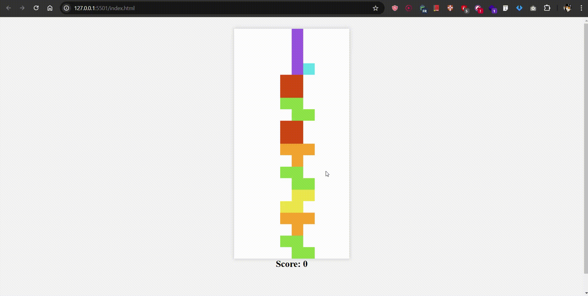

# Tetris Game Refactor Summary

## Overview
This document provides a summary of the refactor of a basic Tetris game built with JavaScript, HTML, and the `<canvas>` API. The refactor focuses on improving the naming conventions for variables and functions to enhance clarity, consistency, and readability throughout the codebase.

## Key Components

### 1. **Canvas Setup**
The game uses a canvas element for rendering the game grid and Tetris pieces. The rendering context is set to 2D, and the canvas is scaled to simplify the rendering of each cell and piece.

### 2. **Piece Shapes and Colors**
The game contains predefined shapes (tetrominoes) and associated colors. Each shape is represented as a 2D matrix, and each piece has a specific color that makes it distinguishable.

### 3. **Grid Dimensions**
The game grid is a 10x20 grid, consisting of rows and columns. The grid stores the state of each cell (whether it's filled or empty).

### 4. **Game State Variables**
The game state includes several key variables:
- **Game Grid**: Stores the current layout of the grid, where pieces are placed.
- **Active Piece**: Tracks the current piece falling on the grid.
- **Player Score**: Keeps track of the player's score, which is incremented when full rows are cleared.
- **Game Loop**: Controls the game flow by repeatedly updating the game state.
- **Pause and Game Over Flags**: Flags to manage whether the game is paused or if the game is over.

### 5. **Main Game Functions**

- **Game Loop**: This function starts and manages the periodic updates of the game state, such as generating new pieces, moving them, checking for collisions, and clearing rows.
- **Move Piece Down**: Handles the downward movement of the active piece and checks if it has collided with any other pieces or the bottom of the grid.
- **Clear Completed Rows**: Detects full rows and removes them, updating the score.
- **Rotate Piece**: Allows the player to rotate the current piece, if there is no collision.
- **Collision Detection**: Checks whether the current piece collides with the existing blocks on the grid, ensuring valid movement and rotation.
- **End Game**: The game ends when the active piece collides with the top of the grid.

### 6. **User Input Handling**
User inputs are captured via keyboard events. The arrow keys are used to move and rotate the pieces, while other keys are used to pause or restart the game.

### 7. **Game Over and Restart**
When the game ends, a game over modal is displayed. Players can restart the game, resetting the grid, score, and game state.

### 8. **Helper Functions**
Various helper functions handle the initialization of the grid, generation of random pieces, rendering of pieces on the canvas, and updating the grid display.

## Game Flow

1. **Starting the Game**: The game begins with an empty grid and a new piece randomly selected from predefined shapes.
2. **Piece Movement**: The player controls the piece using the arrow keys to move it left, right, or down. The player can also rotate the piece.
3. **Row Clearing**: When a row is completely filled, it is cleared, and the score is updated accordingly.
4. **Collision Handling**: If a piece collides with another or the bottom of the grid, it is placed in position, and a new piece starts falling.
5. **Game Over**: If a piece reaches the top of the grid and collides with existing blocks, the game ends.
6. **Restarting**: The game can be restarted at any time by the player after a game over, resetting the grid, score, and state.

## Conclusion
The refactor improves the readability and maintainability of the Tetris code by adopting clearer and more consistent naming conventions for variables and functions. 